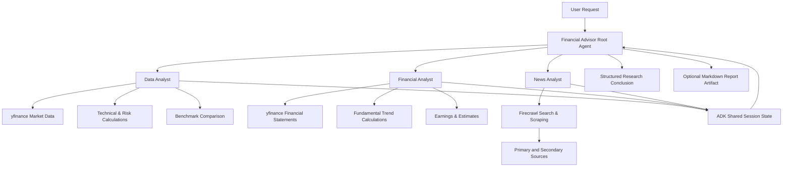
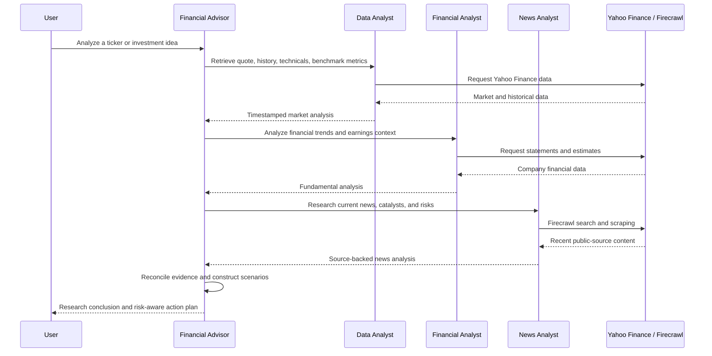

# Multi-Agent Financial Analyst & Advisor

An institutional-style financial research assistant built with **Google Agent Development Kit (ADK)**, **OpenAI language models**, **Yahoo Finance through `yfinance`**, and **Firecrawl**.

The project coordinates multiple specialist agents to analyze public equities using:

- Current and historical market data
- Technical indicators and risk metrics
- Company fundamentals and financial statements
- Earnings expectations and analyst consensus data
- Recent company, industry, regulatory, and macroeconomic news
- Bear, base, and bull investment scenarios
- Evidence-based `BUY`, `ACCUMULATE`, `HOLD`, `REDUCE`, `SELL`, `WATCH`, or `INSUFFICIENT DATA` conclusions

> **Important:** This project is a research and educational tool. It is not a licensed investment adviser, broker, fiduciary, exchange data terminal, or trade-execution platform. Financial data may be delayed, incomplete, revised, or inaccurate. Verify material facts through primary filings, investor-relations publications, regulators, and a real-time broker or exchange feed before trading.

---

## Project Overview

The Financial Advisor Agent acts as the central research coordinator. When a user asks for an equity review or a buy/hold/sell analysis, the root agent delegates work to three specialist agents:

1. **Data Analyst** — retrieves market data and calculates price, momentum, volatility, drawdown, and benchmark metrics.
2. **Financial Analyst** — evaluates financial statements, revenue growth, profitability, free cash flow, leverage, liquidity, earnings expectations, and valuation context.
3. **News Analyst** — uses Firecrawl to locate and scrape recent company news, filings, regulatory developments, catalysts, and bearish evidence.

The root agent then combines the specialist outputs into a structured investment-research response. It can also save a completed report as a Markdown artifact.

---

## Key Features

### Market and Technical Analysis

The Data Analyst can retrieve and calculate:

- Company identity, exchange, sector, industry, and market capitalization
- Current or most recently available price
- 52-week high and low
- Trailing and forward price-to-earnings ratios
- Price-to-sales and price-to-book ratios
- Enterprise-value-to-EBITDA
- Dividend yield and beta
- 5-day, 21-day, 63-day, and 252-day returns
- 20-day, 50-day, and 200-day moving averages
- RSI-14
- MACD and MACD signal
- Annualized volatility
- Maximum drawdown
- Recent OHLCV records
- Relative performance against a benchmark such as `SPY`
- Beta, correlation, tracking error, and information ratio

### Fundamental Analysis

The Financial Analyst can evaluate:

- Annual and quarterly income statements
- Balance sheets
- Cash-flow statements
- Revenue growth
- Gross, operating, net, EBITDA, and free-cash-flow margins
- Operating cash flow and free-cash-flow trends
- Cash-to-debt and debt-to-equity ratios
- Current ratio
- Earnings dates and earnings surprises
- Growth estimates
- Analyst recommendation summaries
- Earnings quality, capital intensity, leverage, liquidity, dilution, and cyclicality

### Current News and Catalyst Research

The News Analyst uses Firecrawl to search and scrape public web content. It is instructed to prioritize:

1. Company investor-relations announcements
2. SEC and other regulatory filings
3. Government and regulatory agencies
4. Exchange notices
5. Court or legal records
6. Reputable financial reporting
7. Secondary commentary

It also searches for disconfirming evidence, including:

- Guidance reductions
- Dilution or capital raises
- Litigation
- Regulatory investigations
- Accounting concerns
- Insider transactions
- Competitive threats
- Product delays or failed launches
- Adverse macroeconomic or industry developments

### Risk-Aware Recommendation Framework

The root agent uses one of the following labels:

- `BUY`
- `ACCUMULATE`
- `HOLD`
- `REDUCE`
- `SELL`
- `WATCH`
- `INSUFFICIENT DATA`

A completed recommendation should include:

- Data freshness and research status
- Recommendation, conviction, and investment horizon
- Investment thesis
- Fundamental and valuation analysis
- Technical and benchmark analysis
- Current catalysts
- Strongest bear case
- Bear, base, and bull scenarios
- Key risks and thesis-breakers
- Upgrade and downgrade conditions
- Risk-conscious action plan
- Sources and data limitations

The system should return `WATCH` or `INSUFFICIENT DATA` instead of generating a confident trade opinion when important information is missing, stale, or unavailable.

---

## Architecture



### Agent Workflow



---

## Project Structure

```text
financial-analyst-agent/
├── .env
├── .gitignore
├── .python-version
├── pyproject.toml
├── uv.lock
├── README.md
└── financial_advisor/
    ├── __init__.py
    ├── agent.py
    ├── prompt.py
    ├── tools.py
    └── sub_agents/
        ├── __init__.py
        ├── data_analyst.py
        ├── financial_analyst.py
        └── news_analyst.py
```

### File Responsibilities

| File                                                | Responsibility                                                                                                       |
| --------------------------------------------------- | -------------------------------------------------------------------------------------------------------------------- |
| `financial_advisor/agent.py`                        | Defines the root coordinator, model configuration, specialist-agent tools, and Markdown report artifact creation.    |
| `financial_advisor/prompt.py`                       | Contains the root agent's research process, evidence standards, recommendation framework, and safety constraints.    |
| `financial_advisor/tools.py`                        | Defines the Firecrawl search and scraping tool used for current web research.                                        |
| `financial_advisor/sub_agents/data_analyst.py`      | Retrieves Yahoo Finance market data and calculates technical, volatility, drawdown, and benchmark metrics.           |
| `financial_advisor/sub_agents/financial_analyst.py` | Retrieves financial statements and calculates fundamental trends, margins, cash generation, liquidity, and leverage. |
| `financial_advisor/sub_agents/news_analyst.py`      | Searches for recent news, primary sources, catalysts, controversies, and disconfirming evidence.                     |
| `.env`                                              | Stores API keys and the configurable model name. Never commit this file.                                             |
| `pyproject.toml`                                    | Defines the project metadata, supported Python version, and dependencies.                                            |
| `uv.lock`                                           | Locks exact resolved dependency versions for reproducible installations.                                             |

---

## Technology Stack

- **Python 3.11+**
- **Google Agent Development Kit (`google-adk`)**
- **LiteLLM** for connecting Google ADK to an OpenAI model
- **OpenAI API** as the language-model provider
- **Firecrawl** for current web search and scraping
- **yfinance** for public market and company financial data
- **pandas** and **NumPy** for calculations and time-series analysis
- **python-dotenv** for environment-variable loading
- **uv** for project creation, dependency management, virtual environments, and lockfiles

---

# Installation and Setup

## 1. Install `uv`

On macOS or Linux:

```bash
curl -LsSf https://astral.sh/uv/install.sh | sh
```

On macOS, Homebrew can also be used:

```bash
brew install uv
```

Confirm that the installation succeeded:

```bash
uv --version
```

---

## 2. Create the Project with `uv init`

Create and enter a new project directory:

```bash
uv init financial-analyst-agent
cd financial-analyst-agent
```

`uv init` creates the initial project files, including a `pyproject.toml`, `.python-version`, and starter application file.

Remove the generated starter file if it is not needed:

```bash
rm -f main.py
```

Create the package directories:

```bash
mkdir -p financial_advisor/sub_agents
```

Copy the project files into the corresponding directories shown in the project structure above.

---

## 3. Add the Required Dependencies

The easiest approach is to let `uv` add the packages to `pyproject.toml`:

```bash
uv add google-adk litellm openai firecrawl-py yfinance pandas numpy python-dotenv
```

This command updates `pyproject.toml`, resolves compatible versions, creates the virtual environment when necessary, and updates `uv.lock`.

### Alternative: Copy Dependencies into `pyproject.toml`

You may instead copy the following dependency section into your existing `pyproject.toml`:

```toml
[project]
name = "financial-analyst-agent"
version = "0.1.0"
description = "A multi-agent financial research assistant built with Google ADK, OpenAI, Firecrawl, and yfinance."
readme = "README.md"
requires-python = ">=3.11"
dependencies = [
    "firecrawl-py",
    "google-adk",
    "litellm",
    "numpy",
    "openai",
    "pandas",
    "python-dotenv",
    "yfinance",
]
```

After copying or editing the dependencies, run:

```bash
uv sync
```

`uv sync` reads `pyproject.toml` and `uv.lock`, creates or updates `.venv`, installs the project dependencies, and aligns the environment with the locked dependency set.

Whenever another developer clones the repository, they can install the complete environment with:

```bash
uv sync
```

They do not need to install each dependency manually when `pyproject.toml` and `uv.lock` are already present.

---

## 4. Activate the Virtual Environment

`uv run` can execute commands without manually activating the environment. However, manual activation is also possible.

On macOS or Linux:

```bash
source .venv/bin/activate
```

On Windows PowerShell:

```powershell
.venv\Scripts\Activate.ps1
```

To leave the environment:

```bash
deactivate
```

---

## 5. Configure Environment Variables

Create a `.env` file in the project root:

```bash
touch .env
```

Add the following values:

```env
OPENAI_API_KEY=your_openai_api_key
FIRECRAWL_API_KEY=your_firecrawl_api_key
FINANCIAL_AGENT_MODEL=openai/gpt-5.4-mini
```

### Environment Variable Reference

| Variable                |              Required | Purpose                                                          |
| ----------------------- | --------------------: | ---------------------------------------------------------------- |
| `OPENAI_API_KEY`        |                   Yes | Authenticates requests to the OpenAI API through LiteLLM.        |
| `FIRECRAWL_API_KEY`     | Yes for news research | Authenticates Firecrawl searches and page scraping.              |
| `FINANCIAL_AGENT_MODEL` |           Recommended | Selects the OpenAI model used by the root and specialist agents. |

Do not surround the values with quotation marks unless the value itself requires them.

---

## 6. Change or Upgrade the OpenAI Model

The model is controlled through the `FINANCIAL_AGENT_MODEL` environment variable. You do **not** need to edit every agent file.

The default configuration is:

```env
FINANCIAL_AGENT_MODEL=openai/gpt-5.4-mini
```

You may change it to another OpenAI model available to your API account:

```env
FINANCIAL_AGENT_MODEL=openai/<supported-openai-model-name>
```

For example, you may choose a more capable model when stronger synthesis, reasoning, or complex financial analysis is more important than cost and latency. You may also choose a smaller model when lower cost and faster responses are more important.

The `openai/` prefix is required because Google ADK connects to OpenAI through LiteLLM's provider/model naming format.

Before changing the model:

1. Confirm that the model is currently available through the OpenAI API.
2. Confirm that your OpenAI project has access to it.
3. Review its token limits, latency, and pricing.
4. Run a complete test because tool-calling behavior can differ between models.

A higher-priced model does not automatically make market data more current. Data freshness still depends on Yahoo Finance, Firecrawl, the original source publication time, and the quality of the retrieved evidence.

---

## 7. Protect API Keys

Add the following to `.gitignore`:

```gitignore
# Environment variables and secrets
.env
.env.*
!.env.example

# Python and uv
.venv/
__pycache__/
*.py[cod]
.python-version

# Local ADK/session artifacts
.adk/

# macOS
.DS_Store
```

Create a safe `.env.example` for repository users:

```env
OPENAI_API_KEY=
FIRECRAWL_API_KEY=
FINANCIAL_AGENT_MODEL=openai/gpt-5.4-mini
```

Never commit your real `.env` file or API keys.

---

# Running the Agent

## Option 1: Run with the Google ADK Web Interface

From the project root, run:

```bash
uv run adk web
```

Open the local address shown in the terminal, select the `financial_advisor` agent, and begin a conversation.

Depending on your installed ADK version, you may also specify the project directory:

```bash
uv run adk web .
```

## Option 2: Run with the ADK Command-Line Interface

```bash
uv run adk run financial_advisor
```

## Validate the Python Package

Before launching the application, compile the package to detect syntax or import errors:

```bash
uv run python -m compileall financial_advisor
```

---

# Example Prompts

## General Research View

```text
Analyze Microsoft stock. Give me a general 12-month research view using fundamentals,
technical indicators, benchmark performance, current news, and bear/base/bull scenarios.
```

## Personalized Holding Review

```text
I own 25 shares of NVDA at an average price of $120. My horizon is two years, I have a
moderate-to-aggressive risk tolerance, and this position is 12% of my portfolio. Should I
buy more, hold, reduce, or sell? Explain what would invalidate the thesis.
```

## Shorter-Term Trade Research

```text
Research AMD as a possible three-month trade. Discuss momentum, volatility, upcoming events,
entry considerations, invalidation conditions, maximum-loss planning, and the main downside risks.
```

## Comparative Analysis

```text
Compare AAPL and MSFT as long-term investments. Analyze growth, margins, free cash flow,
valuation, relative performance, catalysts, risks, and which type of investor each may suit.
```

## Save a Report

```text
Analyze TSLA using all specialist agents and save the final research report as a Markdown artifact.
```

---

# How the Data Flows

## 1. User Request

The user identifies a company, ticker, ETF, market question, or portfolio decision. For a more personalized response, the user can provide:

- Whether the security is already owned
- Average purchase price
- Investment objective
- Intended holding period
- Risk tolerance
- Maximum acceptable loss
- Position size
- Portfolio concentration

When these details are unavailable, the agent should provide a general research view rather than pretending to know the user's financial circumstances.

## 2. Root-Agent Delegation

For a directional recommendation or price-target request, the root agent calls all three specialists.

The specialists write their outputs into Google ADK's shared state using:

- `data_analyst_result`
- `financial_analyst_result`
- `news_analyst_result`

## 3. Evidence Collection

The Data Analyst and Financial Analyst use Yahoo Finance through `yfinance`. The News Analyst uses Firecrawl to search and scrape current public sources.

Each tool returns structured information, timestamps, warnings, or explicit errors. This allows the parent agent to distinguish between available evidence and missing data.

## 4. Synthesis

The root agent reconciles:

- Fundamentals
- Valuation
- Price behavior
- Relative performance
- Risk metrics
- Recent catalysts
- Bearish evidence
- User horizon and risk profile

## 5. Final Output

The final answer is designed to present a research conclusion rather than a guaranteed prediction. It includes multiple scenarios, risks, thesis-breakers, and evidence that would change the recommendation.

---

# Report Artifact Generation

The `save_advice_report` tool creates a Markdown report containing:

- Executive summary
- Market and technical analysis
- Fundamental analysis
- News and catalyst review
- Data limitations
- UTC generation timestamp

The output filename follows this format:

```text
<TICKER>_investment_research.md
```

Example:

```text
AAPL_investment_research.md
```

The report is stored using Google ADK's artifact system.

---

# Design Decisions

## Why Use Multiple Agents?

Financial research involves different forms of reasoning. Separating responsibilities helps prevent one oversized prompt from mixing data retrieval, accounting analysis, technical calculations, web research, and recommendation synthesis.

Each specialist has a narrower role:

- The Data Analyst focuses on reproducible market calculations.
- The Financial Analyst focuses on accounting and business quality.
- The News Analyst focuses on current external developments and source quality.
- The root agent reconciles their outputs and controls the final conclusion.

## Why Use `yfinance`?

`yfinance` provides convenient access to publicly available Yahoo Finance data for prototyping, education, and personal research. It supports price history, company metadata, financial statements, earnings data, estimates, and analyst summaries.

However, it is not an institutional execution feed and should not be treated as authoritative for time-sensitive trading.

## Why Use Firecrawl?

Firecrawl enables the agent to search the public web and convert retrieved pages into model-readable Markdown. This gives the News Analyst access to recent information beyond the language model's static training knowledge.

The tool preserves source titles, URLs, publication dates when available, retrieval timestamps, and cleaned page content.

## Why Use LiteLLM?

Google ADK's LiteLLM integration allows the project to use an OpenAI model while retaining Google ADK's agent, tool, state, and artifact orchestration.

The project therefore defines models in this format:

```python
LiteLlm(model="openai/gpt-5.4-mini")
```

The actual model name is read from the environment so it can be changed centrally.

---

# Limitations

## Not a Bloomberg Terminal

This project may provide a Bloomberg-inspired research workflow, but it does not replicate Bloomberg Terminal infrastructure. It does not include:

- Licensed real-time exchange feeds
- Bloomberg proprietary data
- Institutional order books
- Guaranteed corporate-action normalization
- Trade execution
- Portfolio accounting
- Professional compliance tooling
- Complete analyst transcripts
- Complete global filing coverage
- Guaranteed low-latency alerts

## Yahoo Finance Limitations

Yahoo Finance data may be:

- Delayed
- Incomplete
- Temporarily unavailable
- Inconsistent across securities
- Restated after the initial retrieval
- Missing for smaller or international issuers
- Incorrectly mapped for certain accounting line items

Always reconcile material financial values with the issuer's official filing.

## Firecrawl and Web-Source Limitations

Search results may contain:

- Duplicate or syndicated stories
- Incorrect publication dates
- Paywalled or partially scraped pages
- Rumors or unverified claims
- Search-ranking bias
- Outdated articles
- Secondary reporting that misstates a primary source

The News Analyst is instructed to prefer primary sources, but source verification remains essential.

## Model Limitations

The language model may:

- Misinterpret financial context
- Overweight a recent event
- Generate weak assumptions
- Misjudge whether information is priced in
- Produce inconsistent conclusions across runs
- Misuse a tool result despite safeguards

A more capable OpenAI model may improve synthesis, but it cannot repair missing or inaccurate source data.

## Regulatory and Suitability Limitations

The agent does not know a user's complete income, tax status, liquidity needs, liabilities, jurisdiction, legal restrictions, or total portfolio unless explicitly provided. Its output should not be treated as individualized regulated financial advice.

---

# Troubleshooting

## `uv: command not found`

Restart the terminal after installing `uv`, or ensure the installation directory is on `PATH`.

```bash
uv --version
```

## Missing Dependencies or Import Errors

Run:

```bash
uv sync
```

Then validate imports:

```bash
uv run python -m compileall financial_advisor
```

## `OPENAI_API_KEY` Is Missing

Confirm that `.env` exists in the project root and contains:

```env
OPENAI_API_KEY=your_key
```

Then restart the ADK server.

## Firecrawl Search Is Failing

Confirm that:

```env
FIRECRAWL_API_KEY=your_key
```

Also confirm that the Firecrawl account has available credits and that the requested pages are publicly accessible.

## Model Is Not Available

Change:

```env
FINANCIAL_AGENT_MODEL=openai/gpt-5.4-mini
```

to a supported OpenAI API model available to your account. Keep the `openai/` prefix when using LiteLLM.

## Yahoo Finance Returns Empty Data

Possible causes include:

- Invalid ticker
- Unsupported security
- Temporary throttling
- Network failure
- Missing Yahoo Finance fields
- Newly listed or delisted company
- International ticker requiring an exchange suffix

Try the exact Yahoo Finance ticker, such as an exchange-specific symbol when applicable.

## ADK Cannot Discover the Agent

Confirm that:

- The folder is named `financial_advisor`
- `financial_advisor/__init__.py` exists
- `financial_advisor/agent.py` defines `root_agent`
- You run ADK from the parent project directory

The end of `agent.py` should include:

```python
root_agent = financial_advisor
```

---

# Recommended Improvements

Potential future enhancements include:

- SEC EDGAR integration for direct filing retrieval
- Company investor-relations API or RSS ingestion
- Real-time broker or paid market-data integration
- Earnings-call transcript analysis
- Options-chain and implied-volatility analysis
- Portfolio-level factor exposure and correlation analysis
- Sector-specific valuation models
- Discounted cash-flow valuation tools
- Dividend-discount and net-asset-value models
- Backtesting and walk-forward validation
- Persistent research history and thesis tracking
- Scheduled alerts for earnings, filings, and thesis-breakers
- Human approval before any broker integration
- Automated source-quality scoring
- Unit and integration tests for financial calculations
- Caching and rate-limit controls
- Observability, tracing, and token-cost monitoring

---

# Suggested Testing Checklist

Before relying on the project, test the following:

- [ ] A large-cap U.S. stock with complete data
- [ ] An ETF
- [ ] A financial institution with sector-specific accounting
- [ ] A REIT
- [ ] A company with negative earnings
- [ ] A newly listed company
- [ ] An international ticker
- [ ] An invalid ticker
- [ ] A Firecrawl API failure
- [ ] A missing OpenAI key
- [ ] A missing Firecrawl key
- [ ] A model name that is unavailable
- [ ] A request with no user risk profile
- [ ] A request with a complete portfolio context
- [ ] A saved Markdown report artifact

---

# Development Commands

Install or update dependencies:

```bash
uv sync
```

Add a new dependency:

```bash
uv add <package-name>
```

Remove a dependency:

```bash
uv remove <package-name>
```

Update the lockfile and environment:

```bash
uv lock --upgrade
uv sync
```

Run Python through the managed environment:

```bash
uv run python
```

Launch the ADK web interface:

```bash
uv run adk web
```

Compile all Python files:

```bash
uv run python -m compileall financial_advisor
```

---

# Disclaimer

This software is provided for educational, research, and demonstration purposes only. Nothing generated by this project constitutes financial, investment, tax, accounting, or legal advice. No output is a recommendation or solicitation to buy or sell any security. Past performance does not guarantee future results. Investing involves risk, including possible loss of principal.

Users are responsible for independently verifying all data, assumptions, calculations, sources, and conclusions before making any financial decision.

---

## License

Add the license appropriate for your project before public distribution. An MIT license is commonly used for portfolio and open-source demonstration projects, but you should select a license that matches your intended use.
